*Publish APIs*


**Objectives**

Publishing APIs can be broadly defined by the following tasks:

1.  Create the API products on Edge that bundle your APIs.
2.  Register app developers on Edge.
3.  Register apps on Edge.
4.  Provide documentation and community support for your APIs,
    including:
    -   API reference documentation
    -   Examples and tutorials
    -   Forums, blogs, and other features to foster the developer
        community

**Prerequisites**

-   At a minimum, Lab 1 is completed
-   A developer portal is provisioned

**Estimated Time: 60 mins**

> 

**Adding API Key Verification:**

A *developer* builds an *app* that makes requests to your *APIs* to
access your backend services. The following image shows the relationship
of a developer to an app and to an API:

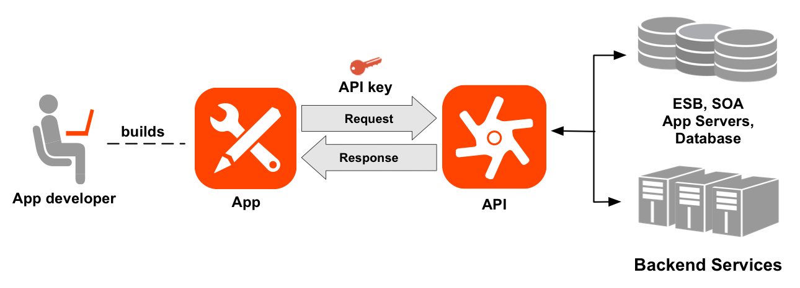

1)  **Adding an API Key Verification Policy**<br/>
&nbsp;&nbsp;a.  Go to the Apigee Edge Management UI browser tab<br/>
&nbsp;&nbsp;b.  Select your API proxy<br/>
&nbsp;&nbsp;c.  Click on the develop tab

> 

&nbsp;&nbsp;d.  Click on Proxy Endpoints -> PreFlow

> 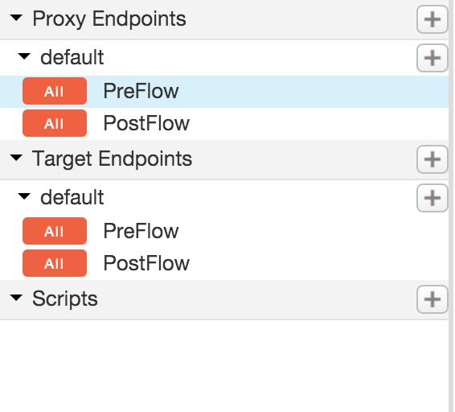

&nbsp;&nbsp;e.  Click on “+ Step” on the Request Flow

> 

&nbsp;&nbsp;f.  Select the ‘Verify API Key’ policy with the following properties:

&nbsp;&nbsp;&nbsp;&nbsp;i.  Policy Display Name: **Verify API Key**<br/>
&nbsp;&nbsp;&nbsp;&nbsp;ii. Policy Name: **Verify-API-Key**

> 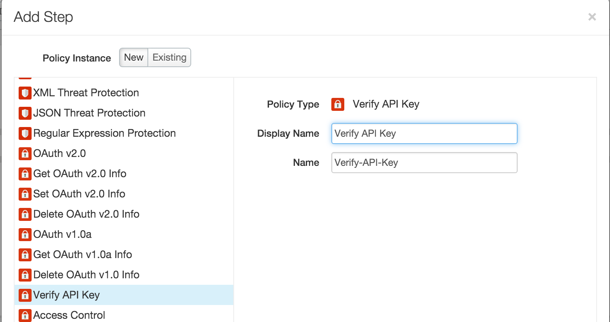

**NOTE:** If you have not completed Lab 2, please skip this step.

The ‘Verify API Key’ policy will get added after the ‘Response Cache’
policy. **Drag and move** the ‘Verify API Key’ policy to be before the
‘Response Cache’ policy

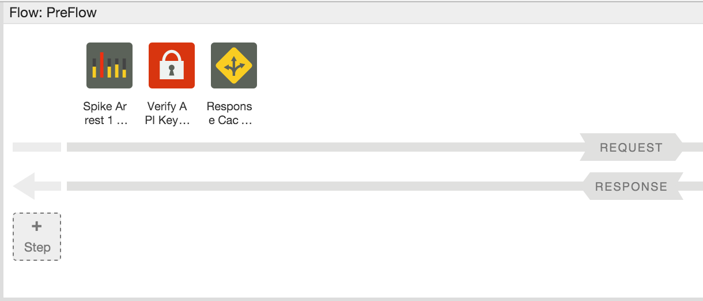

**Note**: It depends on your use case, but typically API Key
verification should be one of the first policies in the flow. In this
scenario, we verify the API Key before the Response Cache policy to
ensure that an API Consumer whose API Key may have been revoked is not
able to get the data from the cache.

&nbsp;&nbsp;g.  Examine the XML configuration in the ‘Code’ panel (or properties using the ‘Property Inspector’ panel) associated with the ‘Verify API Key’ policy. The XML for the policy should look something like this:

  ```
  <?xml version="1.0" encoding="UTF-8" standalone="yes"?>
  <VerifyAPIKey async="false" continueOnError="false" enabled="true" name="Verify-API-Key">
  <DisplayName>Verify API Key</DisplayName>
  <FaultRules/>
  <Properties/>
  <APIKey ref="request.queryparam.apikey"/>
  </VerifyAPIKey>
  ```

*(You can find the policy xml*
[**here**](https://gist.github.com/prithpal/02ee175cc1e00a2de610)*.
Click the “Raw” button and copy/paste into your policy editor).*

Note the &lt;APIKey&gt; element, which identifies where the policy
should check for the API key. In this example, the policy looks for
the API key in a query parameter named 'apikey'. API keys can be
located in a query parameter, a form parameter, or an HTTP header.
Apigee Edge provides a message variable for each type of location. For
policy reference information, see [Verify API Key
policy](http://apigee.com/docs/api-services/reference/verify-api-key-policy)[.](http://apigee.com/docs/api-services/reference/verify-api-key-policy)[](http://apigee.com/docs/api-services/reference/verify-api-key-policy)

2)  **Removing the API Key from the query parameters**

&nbsp;&nbsp;a.  Click on “+ Step” on the Request Flow

> 

&nbsp;&nbsp;b.  Select ‘Assign Message’ policy with the following properties:

&nbsp;&nbsp;&nbsp;&nbsp;i.  Policy Display Name: **Remove APIKey QP**<br/>
&nbsp;&nbsp;&nbsp;&nbsp;ii. Policy Name: **Remove-APIKey-QP**

> 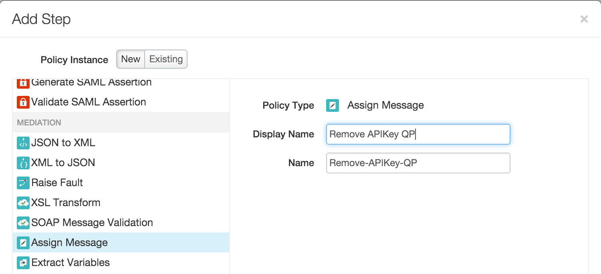

&nbsp;&nbsp;c.  The ‘Remove APIKey QP’ policy will get added after the ‘Response Cache’ policy. **Drag and move** the ‘Remove APIKey QP’ policy to be before the ‘Response Cache’ policy

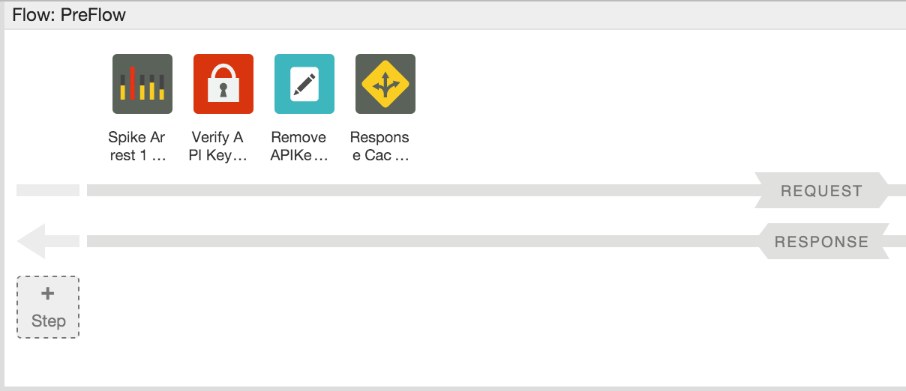

&nbsp;&nbsp;d.  **Save** the configuration

&nbsp;&nbsp;e.  For the ‘Remove APIKey QP’ policy, change the XML configuration of the policy using the 'Code' panel as follows:

  ```
  <?xml version="1.0" encoding="UTF-8" standalone="yes"?>
  <AssignMessage async="false" continueOnError="false" enabled="true" name="Remove-APIKey-QP">
  <DisplayName>Remove APIKey QP</DisplayName>
  <Remove>
  <QueryParams>
  <QueryParam name="apikey"></QueryParam>
  </QueryParams>
  </Remove>
  <IgnoreUnresolvedVariables>true</IgnoreUnresolvedVariables>
  <AssignTo createNew="false" transport="http" type="request"/>
  </AssignMessage>
  ```

(You can find the policy xml
[*here*](https://gist.github.com/prithpal/cbf66ee17b9afe75fdf2). Click
the “Raw” button and copy/paste into your policy editor).

As a security measure, the ‘Remove APIKey QP’ policy simply removes
the ‘apikey’ query parameter from the HTTP request message attached to
the flow so it is not sent to the backend service. In this scenario we
are removing the ‘apikey’ immediately after verify API Key policy, but
depending on your use case, removing the ‘apikey’ may need to be done
at a later stage in the flow.

3)  **Testing the API Key Verification Policy**

Until now anyone with the URL to the ‘{your\_initials}\_hotel’ API
Proxy has been able to make a request with appropriate parameters and
get a response back. Now that you have added the API Key Verification
policy, that will no longer be the case.

&nbsp;&nbsp;a.  Start the Trace session for the ‘**{your\_initials}**\_hotels’ proxy

&nbsp;&nbsp;b.  Now that the API Key Verification policy has been added to the proxy, try and send a test ‘/GET hotels’ request from Postman with the following query parameters: **zipcode=98101&radius=200**

**Note**: Replace the URL of hotels API with **{your\_initials}**\_hotels

&nbsp;&nbsp;c.  You will notice that the following fault is returned since an API Key has not been provided as a request query parameter:

  ```
  {
  fault: {
  faultstring: "Failed to resolve API Key variable request.queryparam.apikey",
  detail: {
  errorcode: "steps.oauth.v2.FailedToResolveAPIKey"
  }
  }
  }
  ```

The above response shows that the API Key Verification policy is being enforced as expected.

&nbsp;&nbsp;d.  Review the Trace for the proxy and the returned response to ensure that the flow is working as expected.

&nbsp;&nbsp;e.  Stop the Trace session for the proxy

**API Products**

API products enable you to bundle and distribute your APIs to multiple developer groups simultaneously, without having to modify code. An API product consists of a list of API resources (URIs) combined with a Service Plan (rate-limiting policy settings) plus any custom metadata required by the API provider. API products provide the basis for access control in Apigee, since they provide control over the set of API resources that apps are allowed to consume.

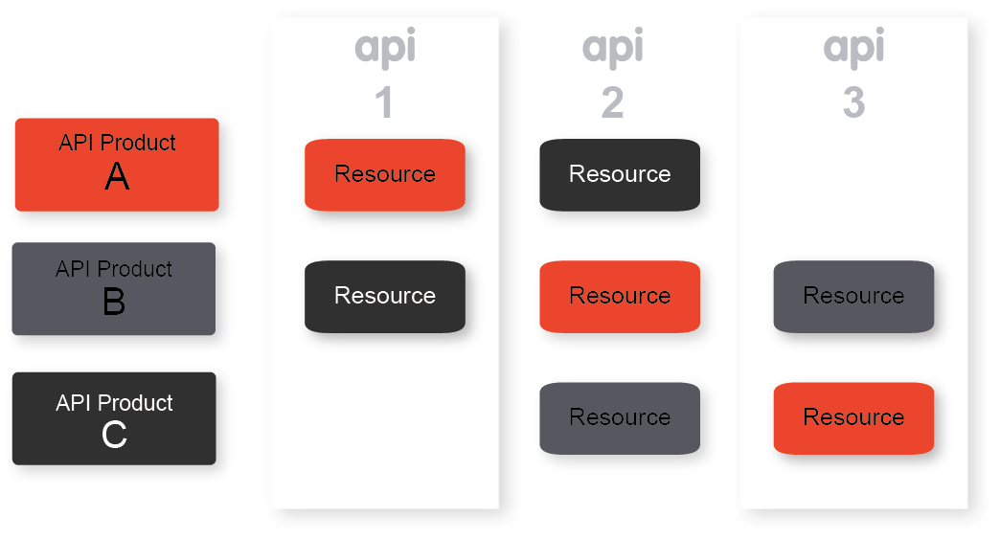

As part of the app provisioning workflow, developer selects from a list of API products. This selection of an API product is usually made in the context of a developer portal. The developer app is provisioned with a key and secret (generated by and stored on Apigee Edge) that enable the app to access the URIs bundled in the selected API product. To access API resources bundled in an API product, the app must present the API key issued by Apigee Edge. Apigee Edge will resolve the key that is presented against an API product, and then check associated API resources and quota settings.

The API supports multiple API products per app key - your developers can consume multiple API products without requiring multiple keys. Also, a key can be 'promoted' from one API product to another. This enables you to promote developers from 'free' to 'premium' API products seamlessly and without user interruption.

The following table defines some of the terms used to register apps
and generate keys:

***API product***   A bundle of API proxies combined with a service plan that sets limits on access to those APIs. API products are the central mechanism that Apigee Edge uses for authorization and access control to your APIs. For more, see [API Products](http://apigee.com/docs/developer-services/content/what-api-product)[](http://apigee.com/docs/developer-services/content/what-api-product)

***Developer***     The API consumer. Developers write apps the make requests to your APIs.

***App***            A client-side app that a developer registers to access an API product. Registering the app with the API product generates the API key for accessing the APIs in that product.

***API key***       A string with authorization information that a client-side app uses to access the resources exposed by the API product. The API key is generated when a registered app is associated with an API product.

**Publishing an API Product**

1)  From the Apigee Edge Management UI, go to Publish → Products

2)  Click on ‘+ Product’ button to add a new product

3)  In the ‘Product Details’ section of the new product screen, enter or select the following values for the various fields:

&nbsp;&nbsp;a.  Display Name: **{Your_Initials}_Hospitality Basic Product**<br/>
&nbsp;&nbsp;b.  Description: **API Bundle for a basic Hospitality App.**<br/>
&nbsp;&nbsp;c.  Environment: **Test**<br/>
&nbsp;&nbsp;d.  Access: **Public**<br/>
&nbsp;&nbsp;e.  Key Approval Type: **Automatic**


4)  In the ‘Resources’ section select the following values for the
    various fields:

&nbsp;&nbsp;a.  API Proxy: **{your\_initial}\_hotels **<br/>
&nbsp;&nbsp;b.  Revision: **1**<br/>
&nbsp;&nbsp;c.  Resource Path: **/**

> 

5)  Click on **‘Import Resources’** to add the **‘/’** resource of your proxy to the API product

6)  Repeat the above two steps for the **‘/\*\*’** resource

7)  Click **‘Save’** to save the API Product**.** The new product should now be listed on the ‘Products’ page.

**Developer Portal**

Developer portals with social publishing features are increasingly being used for communication with the developer community. This includes communicating static content, such as API documentation and
terms-of-use, as well as dynamic community-contributed content such as blogs and forums.

As an API provider, you need a way to expose your APIs, educate
developers about your APIs, sign up developers, and let developers
register apps. Exposing your APIs to developers is only part of creating a truly dynamic community. You also need a way for your developer community to provide feedback, make support and feature requests, and submit their own content that can be accessed by other developers.


**Developers**

Developers access your APIs through apps. When the developer registers an app, they receive a single API key that allows them to access all of the API products associated with the app. However, developers must be registered before they can register an app.

**Register a developer from the developer portal**

1)  Ask your instructor for the URL for the developer portal. On the developer portal home page select **Register**

> 

2)  The registration page appears

> 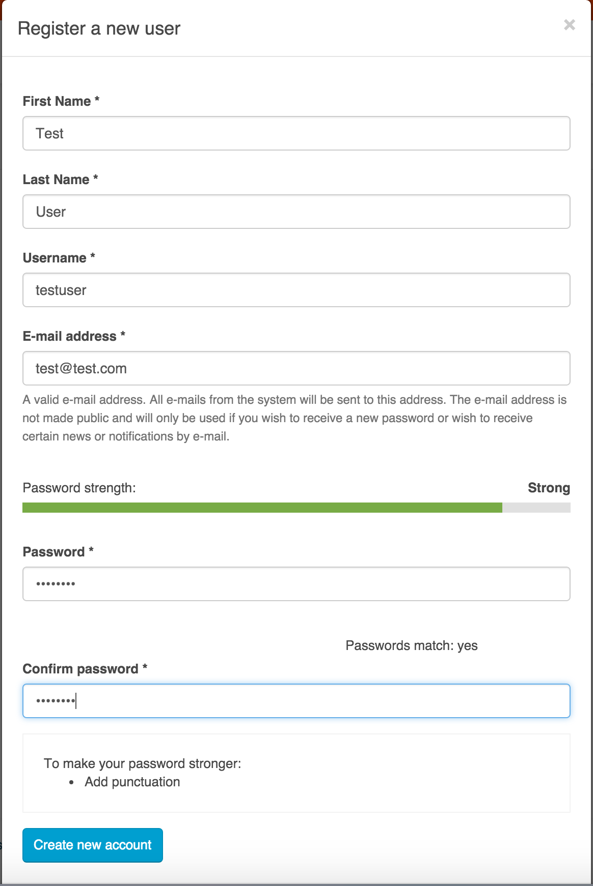

3)  Enter the required information and select **Create new account**. Depending on the new account registration settings, when the new account is created, you could be sent an automated welcome email.

**NOTE**: If you see this message:

> 

Then the developer portal administrator MUST approve the developer
before the developer can sign in. If you see this message ask your instructor to approve your developer account - once that is done then login to the portal.

**Register an app from the developer portal:**

Developers register apps to access your API products. When a developer registers an app, the developer selects the API products to associate with the app and Edge generates an API key. Each app has a single API key that provides access to all API products associated with the app.

Apps allow you to control who can access your APIs. You can revoke an app's key, preventing it from accessing all API products. Or you can revoke access to a single API product associated with the app.


4)  Select **My apps** below your username in the login menu

> 

5)  Click the **+ Add a** **new App** icon.

> 

6)  Enter details for the application and hit **Create App**

> 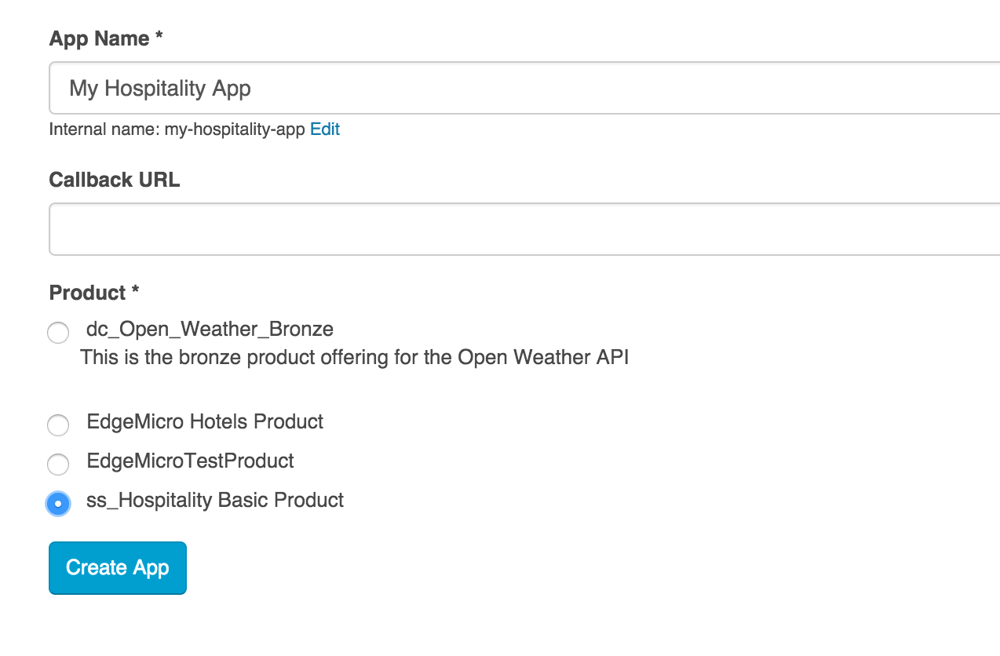

> NOTE: Select the product that you created in the previous step.

7)  Open your new app to view the Consumer Key (aka API Key) and Consumer Secret (aka
    API Secret)

> 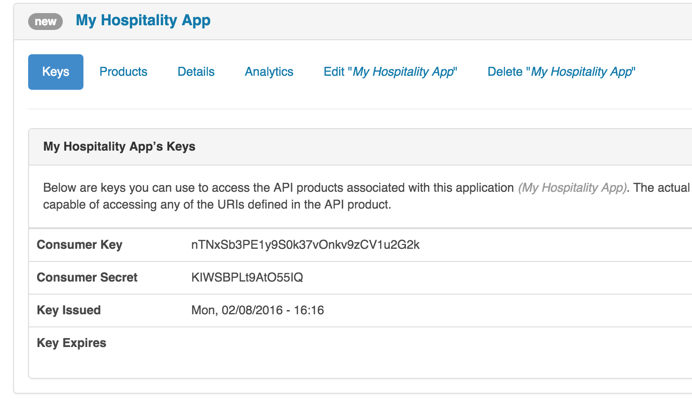

8)  Test the API

&nbsp;&nbsp;a.  Start the Trace session for the ‘**{your\_initials}\_hotels**’ proxy

&nbsp;&nbsp;b.  Now that the API Key Verification policy has been added to the proxy, try and send a test ‘/GET hotels’ request from Postman with the following query parameters: **zipcode=98101&radius=200&apikey={apikey from the dev portal}**

> Note: Replace the URL of hotels API with **{your\_initials}**\_hotel

**Generate API Documentation**

1) Create a model

When you create a model, it's stored in your Edge organization as the
source for the API structure. For more information, see [*About SmartDoc
models and
templates*](http://apigee.com/docs/developer-services/content/using-smartdocs-document-apis#models).

&nbsp;&nbsp;a.  Ask you instructor to change your developer user to have administrator access in the portal. Logout and then back in to the developer portal.

&nbsp;&nbsp;b.  Select **Content > SmartDocs** in the Drupal administration menu.

> 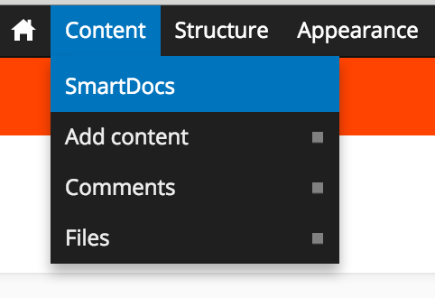

&nbsp;&nbsp;c.  Select **New model** at the top of the page

&nbsp;&nbsp;d.  Enter the following fields:<br/>
&nbsp;&nbsp;&nbsp;&nbsp;- **Name**: The model name that will be displayed across the site.<br/>
&nbsp;&nbsp;&nbsp;&nbsp;- **Internal name**: As you type the **Name**, the internal name displays. The internal name for the model that must be unique among all models.  The internal name must contain only lowercase letters, numbers, and hyphens with no spaces. Select **Edit** to edit this name.<br/>
&nbsp;&nbsp;&nbsp;&nbsp;- **Description**: A description of the model.

> 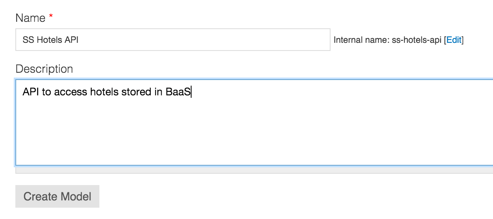

2)  Select **Create Model**.

3)  Click on ‘Import’ to import an API specification

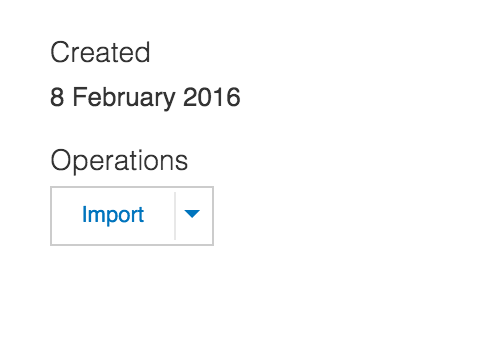

&nbsp;&nbsp;a.  The API specification can be of Swagger 1.2, Swagger 2.0 (JSON or YAML) or WADL formats. In this example, we will use Swagger 2.0 – YAML.<br/>
Open the **hotels-openapi.yaml** file from the lab material in a text editor and change the {baas_org} on line 14 to match your baas org and save the file.<br/>
Back in the dev portal administrator, select the **hotels-openapi.yaml** file

> 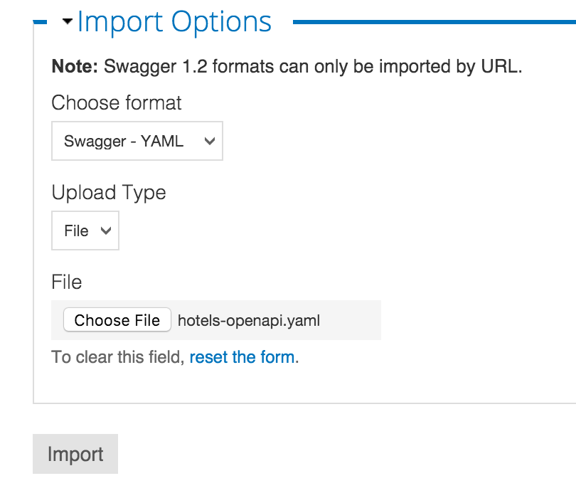

&nbsp;&nbsp;b.  Click on ‘**Import’**

&nbsp;&nbsp;c.  Select all the Operations//Methods that should be published (we will select all)

> 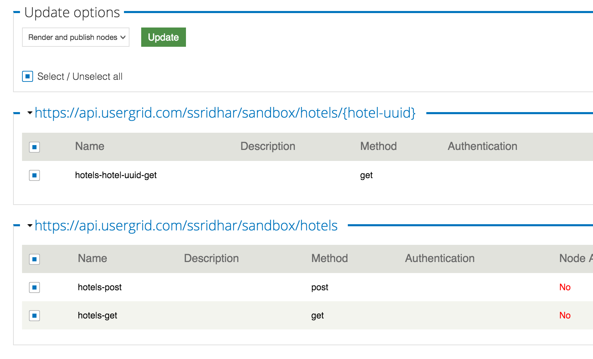

&nbsp;&nbsp;d.  Click on ‘**Update**’

&nbsp;&nbsp;e.  Click on ‘View API Documentation’ to see the published documentation

> 

&nbsp;&nbsp;f.  Click on ‘**hotels-get**’

> 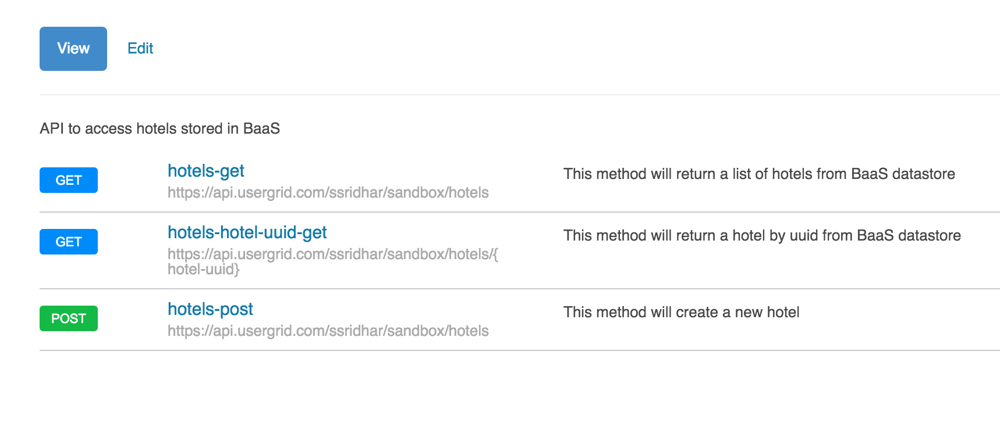

&nbsp;&nbsp;g.  Enter ‘**application/json**’ as the Content-Type. Leave the radius and zipcode empty

&nbsp;&nbsp;h.  Click on ‘**Send this request**’

> 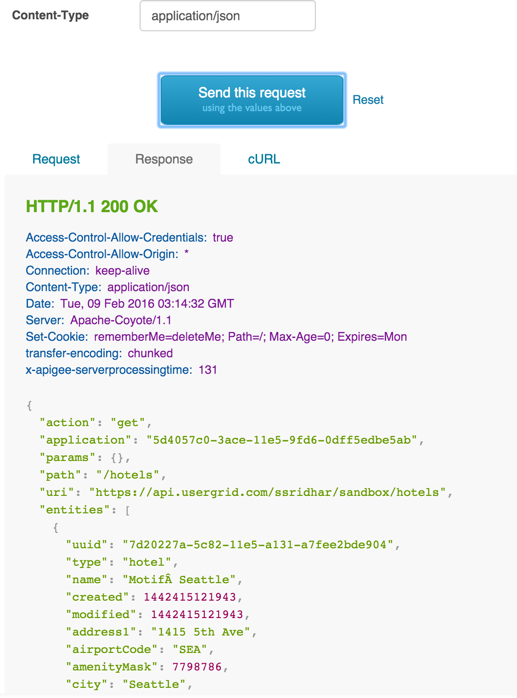

**Summary**

In this exercise, you learnt about how API keys can be used as an
application identifier, how APIs can be packaged in the form of
Products. You also saw how to publish API documentation to the developer portal and finally, how developers are onboarded and how developer applications are registered.
